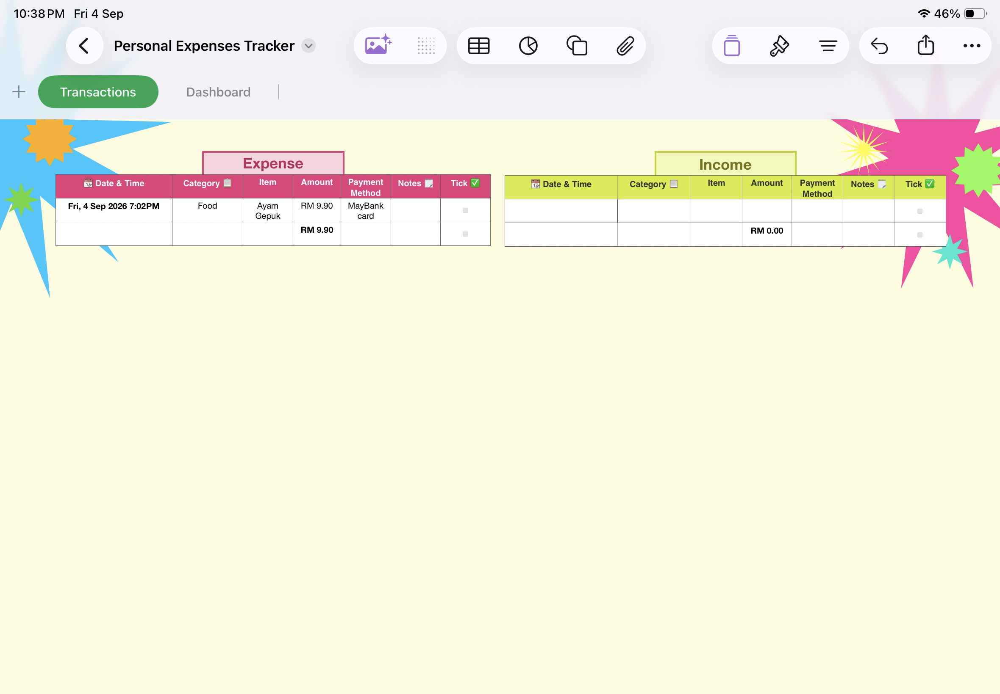
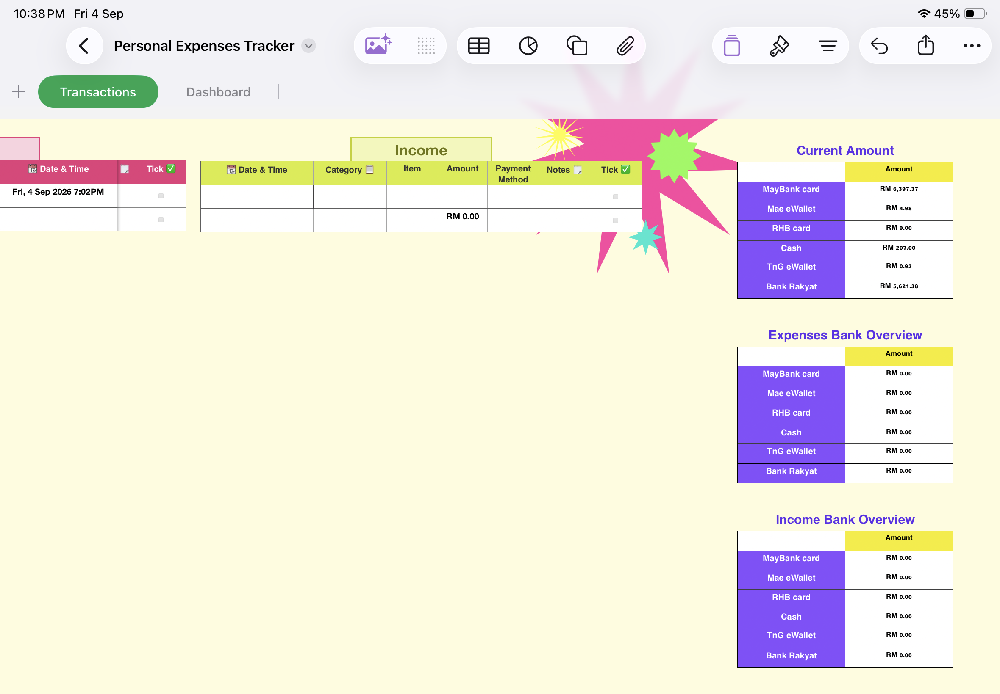
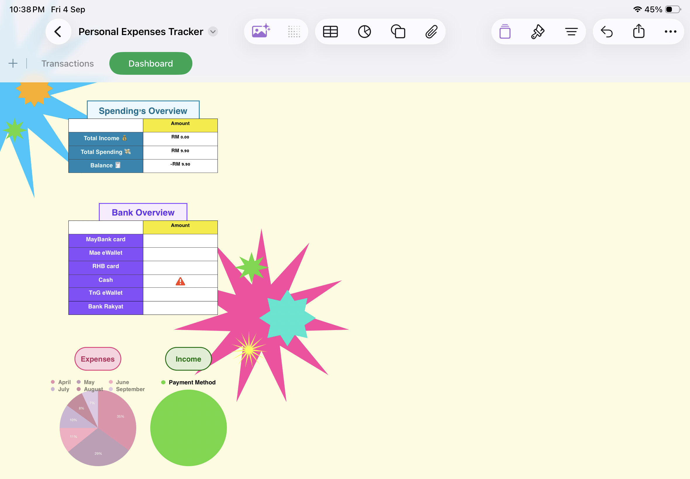
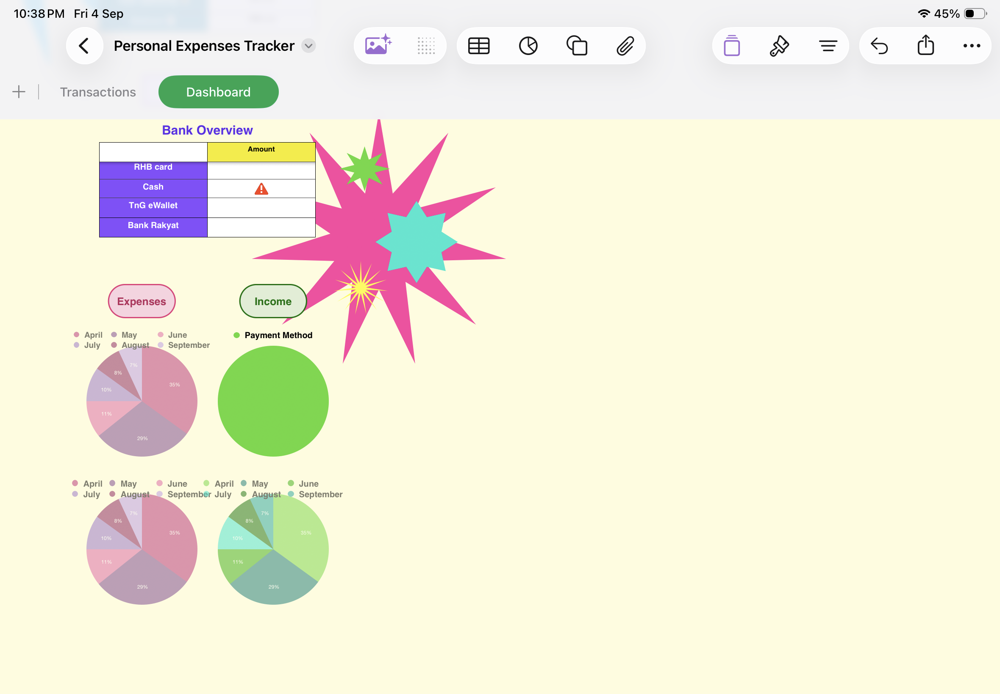
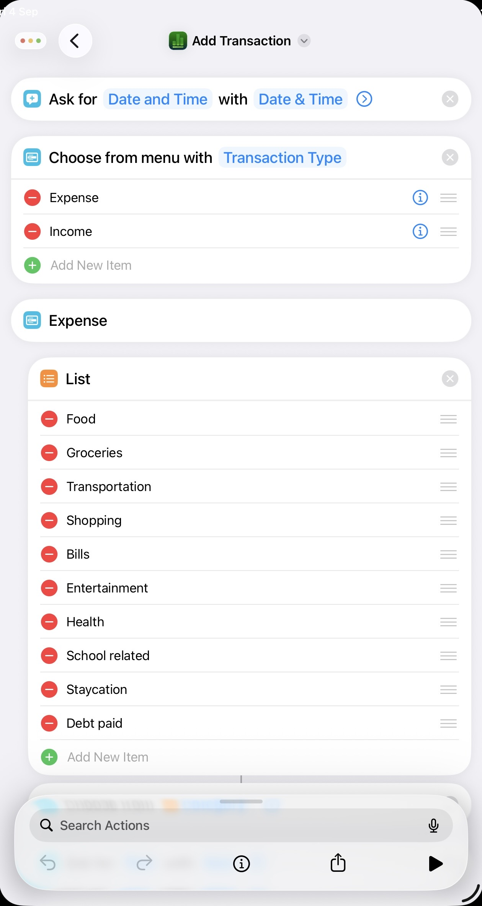
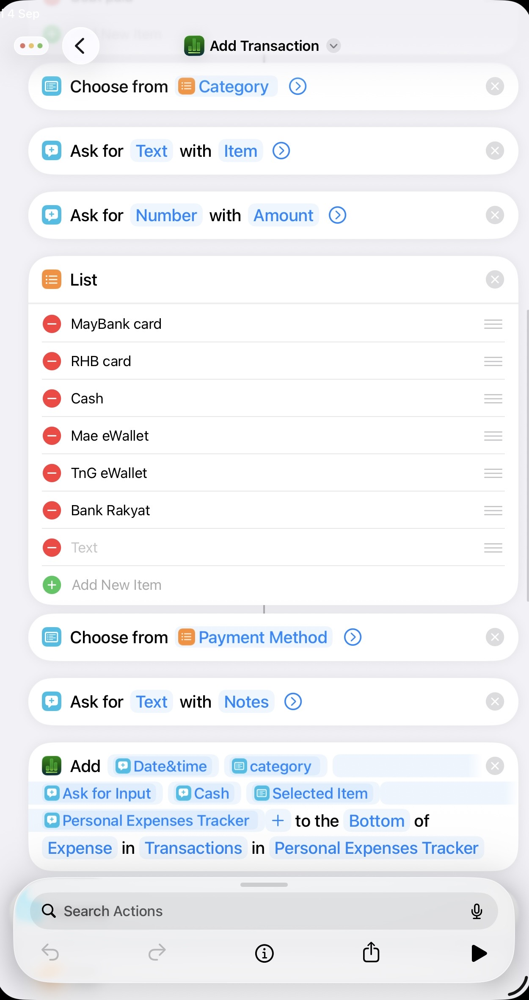
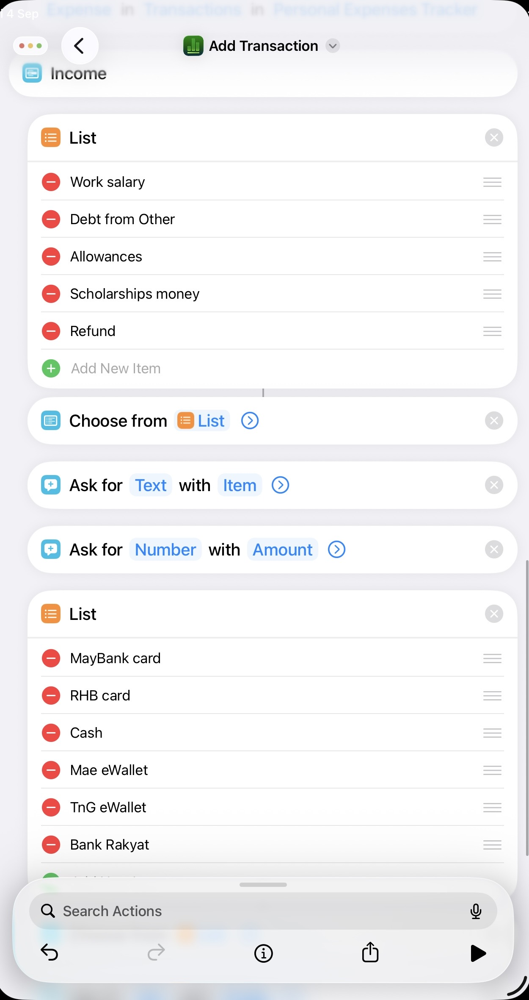
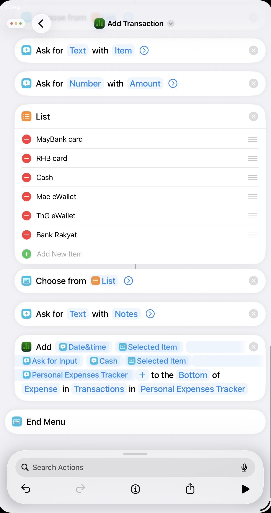

# 💰 Personal Expenses Tracker

A simple personal finance tracking system built using **Apple Numbers** and **Apple Shortcuts**.

The project is designed to make recording daily expenses and income faster and more organized. Instead of manually entering every transaction into a spreadsheet, an Apple Shortcut collects the information through prompts and stores it in an Apple Numbers spreadsheet.

This project is made based on my preferences which is to make an easily access system that i can quickly add my expenses without taking time opening my phone, apps and finding where to write which was what my previous projects features. This project only focus on simpler features that i need.

**Using Apple Shortcuts, my expenses can be recorded just by tapping twice at the back of my Iphone. The shortcuts immediately pop out**

> 🚧 Project Status: In Development
> This is a fully functioning project but I'm adding few additional features that be able to calculate and display the amount of money in each Payment method that i have.

___

# 📌 Overview

The Personal Expenses Tracker combines the automation capabilities of **Apple Shortcuts** with the spreadsheet and data-analysis features of **Apple Numbers**.

When a user runs the Shortcut, they are prompted to enter information about a transaction. The transaction is then automatically added to the Numbers spreadsheet.

The tracker separates **Expenses** and **Income** while keeping the transaction data organized for easier financial analysis.

---

# ✨ Features

## 📝 Quick Transaction Entry

The Shortcut prompts the user to enter:

* 📅 Date
* 🕐 Time
* 💳 Transaction Type
    * Expense
    * Income
* 🏷️ Category
* 📦 Specific Item
* 💰 Amount
* 💳 Payment Method
* 📝 Notes

This reduces the need to manually open Numbers and enter every transaction.

## 📊 Expense & Income Tables

Transactions are organized into separate tables for:

* Expenses
* Income

This makes it easier to distinguish money coming in from money being spent.

## 🧮 Automatic Calculations

Numbers formulas can be used to automatically calculate:

* Total expenses
* Total income
* Spending by category
* Spending by payment method
* Remaining balance
* Other financial summaries

## 💳 Payment Method Analysis

The tracker can visualize payment methods using a **2D pie chart**, showing the percentage of spending made through different payment methods.

Example:
```text
Payment Method
├── MayBank card
├── RHB card
├── Cash
├── Mae eWallet
├── TnG eWallet
└── Bank Rakyat
```

## ⚡ Shortcut Automation

Apple Shortcuts acts as the input interface, allowing transactions to be recorded without manually navigating through the spreadsheet.

---

## 🛠️ Technologies Used

| Technology	| Purpose |
|---|---|
| Apple Numbers	| Data storage, formulas, tables and charts |
| Apple Shortcuts	| Transaction input and automation |
| iPhone / iPad	| Running the Shortcut and managing transactions |
| iCloud	| File synchronization and collaboration |

⸻

🗂️ Project Structure

The system consists of two main components:
```text
Personal Expenses Tracker
│
├── 📱 Apple Shortcut
│   └── Collects transaction information
│
└── 📊 Apple Numbers
    ├── Expense Table
    ├── Income Table
    ├── Summary / Analysis
    └── Charts
```
⸻

🔄 How It Works

The basic workflow is:
```text
User runs Shortcut
        ↓
Shortcut asks for transaction details
        ↓
User enters information
        ↓
Shortcut processes the information
        ↓
Transaction is added to Numbers
        ↓
Numbers formulas update automatically
        ↓
Charts and summaries reflect the new data
```
⸻

📱 Example Workflow

A user purchases lunch for RM12 using an e-wallet.

The Shortcut may ask:
```text
Date: Fri, 4 Sep 2026
Time: 1:15 PM
Transaction Type: Expense
Category: Food
Item: Lunch
Amount: RM12
Payment Method: Cash
Notes: -
```
The information is then stored in the **Expenses** table in Numbers.

⸻

# 📊 Example Data Structure

### Expenses

**Date & Time	          Category	    Item 	         Amount	Payment Method	Notes**
Fri, 4 Sep 2026 1:15 PM	  Food Lunch  Chicken Rice      RM12.00	E-Wallet	-
Fri, 4 Sep 2026 5:30 PM	Transportion       Bus	         RM3.00	Cash	-

### Income

**Date & Time	            Category	       Item 	       Amount	 Payment Method	Notes**
Fri, 4 Sep 2026 10:00 AM	Allowance	Monthly Allowance	RM300.00	   Mae eWallet	-

⸻

# 📈 Financial Dashboard

The Numbers file can be expanded with a dashboard containing:

* 💰 Total Income
* 💸 Total Expenses
* 🏦 Remaining Balance
* 📊 Spending by Category
* 💳 Spending by Payment Method
* 📅 Monthly Spending
* 📈 Income vs. Expenses

Example:
```text
┌─────────────────────────────────┐
│       PERSONAL FINANCES         │
├─────────────────────────────────┤
│                                 │
│  Income       RM 1,000.00       │
│  Expenses     RM   650.00       │
│  Balance      RM   350.00       │
│                                 │
├─────────────────────────────────┤
│      Spending by Category       │
│                                 │
│  🍜 Food             40%        │
│  🚌 Transportation   20%        │
│  🛍️ Shopping         25%        │
│  📚 Education        15%        │
│                                 │
└─────────────────────────────────┘
```
⸻

# 🔐 Privacy

This project is designed as a personal finance tracker.

Financial information is stored within the user’s Apple Numbers file and iCloud environment rather than being uploaded to a separate financial service.

Users should still follow Apple’s account security and iCloud security practices when storing sensitive financial information.

⸻

# 🚧 Current Limitations

The project is still under development.

Current limitations may include:

* Requires Apple Numbers
* Requires Apple Shortcuts
* Designed primarily for Apple’s ecosystem
* Some automation depends on the Numbers/Shortcuts integration
* Dashboard and analytics are still being improved
* More advanced financial features have not yet been implemented

⸻
---
# This is how can try this System
**steps:**
1. Save **Personal Expenses Tracker.numbers** file in **Apple Numbers** application.
2. Open the **Apple Shortcuts links** and add to shortcuts to run the shortcuts.
3. DONE 
4. Add the shortcuts to Homescreen or etc for easy access.

Apple Numbers File : [Numbers File](Personal_Expenses_Tracker.numbers)

Apple Shortcuts : [Links](https://www.icloud.com/shortcuts/ada21c2139964f38b804e942346c7bc4)

## 📸 Screenshots

### Apple Numbers





### Apple Numbers






---

# 🔮 Future Improvements

Possible future improvements include:

* 📅 Monthly and yearly financial summaries
* 📊 More detailed charts
* 🔎 Transaction search and filtering
* 🏷️ Custom categories
* 💰 Budget limits
* 🚨 Overspending alerts
* 📈 Spending trends
* 🧾 Receipt-based transaction entry

⸻

# 🎯 Project Goals

The main goals of this project are to:

1. Make expense recording faster.
2. Reduce repetitive manual spreadsheet entry.
3. Keep income and expenses organized.
4. Automatically calculate financial summaries.
5. Provide visual insights into spending habits.
6. Explore practical automation using Apple’s ecosystem.

⸻

# 💡 Why I Built This

Managing small daily expenses can become difficult when transactions are recorded inconsistently.

This project explores how **automation + spreadsheets** can turn a simple financial spreadsheet into a more convenient personal finance system.

Rather than building a completely separate finance application, the project uses tools that are already available on Apple devices and combines them into a lightweight automated workflow.

⸻

# 📚 Skills Demonstrated

This project demonstrates experience with:

* Spreadsheet design
* Data organization
* Formula-based calculations
* Data visualization
* Workflow automation
* Apple Shortcuts
* User input design
* Problem solving
* Personal productivity system design

⸻

# 📄 Project Status

**Current version:** Development

The project is actively being improved with additional automation, calculations, visualizations and usability features.

⸻

# 👩🏻‍💻 Author

Created as a personal technology and productivity project.

**Personal Expenses Tracker — Apple Numbers × Apple Shortcuts**
